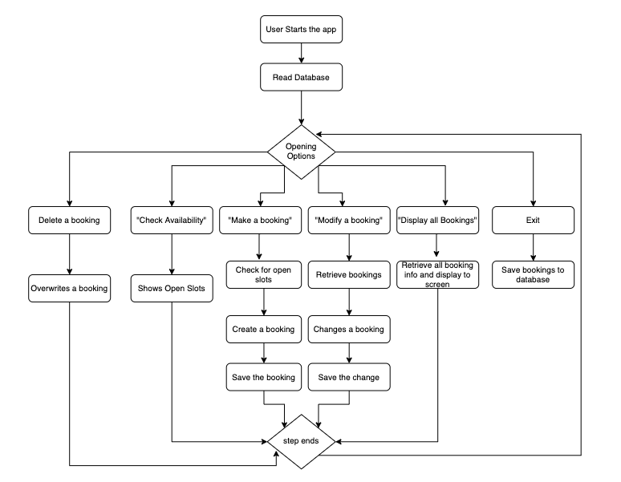

# Bookit
Thanks for trying my first ever terminal app bookit. It is a Restaurant booking handler for small restaurants.

## Installation

1. You will need Ruby installed. 
[Installation guide here](https://www.ruby-lang.org/en/documentation/installation/) 

    I recommend using [asdf](https://asdf-vm.com/)

2. Install [git](https://git-scm.com/downloads)
3. git clone the app to your home directory

```bash
git clone https://github.com/CesDelPino/bookit.git ~/bookit_terminal_app_ft
```
4. Run the setup executable file

```bash
~/bookit_terminal_app_ft/bin/setup
```
Running the setup will install the following dependencies
TTY-Promt, RubyFiglet, Terminal Table, Colorize     

5. To Run the app (chose `a`, or `b`)

`a)` You can run the executable

```bash
~/bookit_terminal_app/bin/bookit
```
`b)` Make it execute anywhere from the terminal with the following steps.

1. Open your `.bash_profile` in a text editor

2. Add this line

```bash
export PATH=$PATH:$HOME/bookit_terminal_app_ft/bin
```

3. Restart your terminal to make sure `.bash_profile` loads the app into your PATH

4. Run the `bookit` executable to start the app

```bash
bookit
``` 
## Contributing

Bug reports and pull requests are welcome on GitHub at https://github.com/CesDelPino/bookit. This project is intended to be a safe, welcoming space for collaboration, and contributors are expected to adhere to the [code of conduct](https://github.com/CesDelPino/bookit/blob/master/CODE_OF_CONDUCT.md).


## License

The app is available as open source under the terms of the [MIT License](https://opensource.org/licenses/MIT).


## Purpose and Scope
### Description
The restaurant booking app will allow a restaurant staff member ("the user") that is handling bookings a reliable way to Make, Modify, and delete restaurant bookings for clients. They will also be able to display a summary of the whole days' activities for any restaurant staff member.

Although developed to satisfy the requirements of the Coder Academy Terminal App assignment. The app was designed to eliminate pen and paper from the users' workflow yet, while also providing a reliable method to keep track of incoming booking requests and guaranteeing there are no double bookings. It allows for the storing of basic data for every booking including Names, Contact Details, and special requests.

The user will load the app, on their computer when a client calls to check for table availability. They will be offered options and prompts that facilitate data gathering. The bookings are stored in permanent memory via a JSON file and transferred to working memory until the app is closed, where all changes will be written to the same file.

### Scope and restrictions
Version 1 of the app will only cater for 1-hour reservations for the table on ONE day. The first reservation is at 12:00 and the last at 21:00. 

### List of features

1. Display all bookings. This feature will print out a table containing all of the bookings currently contained in working memory. To work it uses a bookings variable that is instantiated at the run faze by parsing through the DATABASE json document. When the display_all function is called from the options menu it uses the bookings variable, to creates an array of arrays that are used to generate the required format for display by the Terminal Table GEM.
2. Make a booking. This function will allow the user to select the time they wish to book. It is called from the options menu. It then iterates through the "open_slots" to make sure the booking is free if it's not available it will print an error to screen "That time is not available", and loop back to the opening options. If the time slot is open for bookings then it will call a function to get client data to populate the booking request. It will then store the data into working memory.
3. Modify a booking - This function overwrites ANY bookings. It requests user input for the data then pushes the data into the bookings array thus saving it into working memory.
4. Delete a booking -  This function allows the user to overwrite the data of ANY booking and replace it with the standard value assignment used for open bookings. 
5. View open slots only - This feature iterates through all bookings, and returns an array of empty slots. It will then print to screen ONLY the availability for the day.

### Control flow


### User Interaction

User interaction is taken care of by the options menu loop. It loops continuously until the user exits the app. It allows the user to select the feature of the app.

1. To display all of the bookings, the user selects the first option in the menu. The app will show a table of all the bookings.

2. To make a booking the user selects the "make a booking" option. This brings up another menu of times representing the hour to book, 12, for 1200 13, for 1300 etc. The user is then prompted to enter the data as requested by the app. Name, Contact Phone, and any other notes. After user input, there is a confirmation message displayed, and the user is taken back to the options menu.

3. To modify a booking, the user selects the "modify booking" option in the options loop. They are then presented with a list of times representing the desired timeslot to change. The user selects the timeslot and is prompted to enter information.

4. To delete a booking, the user selects the "delete booking" option from the initial options menu. They are then offered a list of times to change. One the user selects the time, a confirmation message is displayed.

5. To view open slots, the user selects this option from the options loop. They are then shown a list of available times for bookings and are sent back to the options loop.

The user interface is driven by the TTY prompt GEM. Wherever possible, menus populate with options that will take care of errors appearing from the gets command. Instructions on how to select options are in the form of a prompt to move cursor keys. The prompt disappears after the first movement. This sort of handling is ubiquitous as should not need further instruction. When the user is asked for data input. It is also done with TTY prompt.

## Help menu.

```
    -v, --version                    Display the version
    -h, --help                       Display the help message
    -c, --compliment                 Have a compliment!
    -e, --encourage                  An encouraging thought
    -g, --greatest                   Who's the greatest?
    -r, --run                        Run the Bookit app
```

### Implementation 

Is taken care of by using a trello board. You can see the board [here](https://trello.com/b/vVBNmCPK/bookit-app)